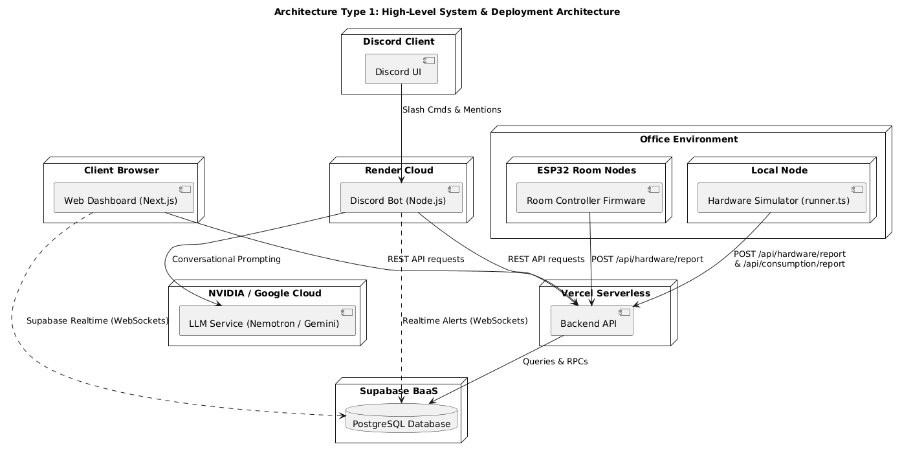

# Chrono Office: Electricity & Device Monitor

Chrono Office is an integrated, real-time IoT monitoring and control system designed to track electrical devices (lights and fans) and electricity consumption across three office rooms (Drawing Room, Work Room 1, and Work Room 2). 

It features:
* **Interactive Web Dashboard**: A real-time Next.js frontend showing active office loads, yesterday's comparison metrics, room controls, and a visual office floor plan.
* **Discord Bot**: Provides a conversational interface to check room status, device power consumption, and recent logs, with proactive warnings when anomalies are detected.
* **Intelligent LLM Chat**: Integration with NVIDIA NIM (Nemotron-3 Super 120B) or Google Gemini API to query live office statuses conversationally.
* **Hardware Simulation Layer**: A hyper-realistic simulator replicating Dhaka office working hours, Brownian voltage walk, staggering, power flicker, and simulated employee interactions.
* **Physical Hardware Blueprint**: Complete circuit schematic design using an Arduino Uno microcontroller, opto-isolated relay channels, ACS712 current sensors, and AC 220V mains wiring.

---

## 🔗 Live Project Links

* **Backend API Hosting**: [https://project-iut-alert-backend.vercel.app/](https://project-iut-alert-backend.vercel.app/)
* **Web Dashboard**: [https://chrono-office-two.vercel.app/](https://chrono-office-two.vercel.app/)
* **Discord Bot Invite**: [Add Bot to Guild](https://discord.com/oauth2/authorize?client_id=1522877796555292682)
* **Tinkercad Hardware Schematic**: [Tinkercad Interactive Circuit](https://www.tinkercad.com/things/d9lKPrRibuv/editel?sharecode=0FRpBOQlyc4BkpXgR8tdaHEMMs3Qnq1KcieN3BWWfIk)

---

## 🚀 System Architecture

### High-Level System & Deployment Architecture
The system layout uses a client-server and publish-subscribe topology:
* **Client Layer**: Web Dashboard (Next.js) showing live meters/controls, and the Discord client interface.
* **Bot Layer**: Discord Bot (Node.js) hosted on Render Cloud, polling metrics and subscribing to active alert triggers.
* **Backend Layer**: Next.js Serverless API endpoints hosted on Vercel acting as the central coordination system.
* **Database Layer**: PostgreSQL Database (Supabase) storing rooms, devices, history, alerts, and consumption records.
* **AI Layer**: NVIDIA NIM / Google Gemini APIs returning factual, conversational status summaries when the bot is queried.
* **Edge / Simulation Layer**: Room nodes (Arduino Uno controllers) or the local Node.js simulator runner pushing telemetry states.



---

## 📡 API Endpoint Reference

All endpoints are hosted on Next.js Serverless and reside under the root backend domain: `https://project-iut-alert-backend.vercel.app/`

### 1. `GET /api/devices`
Returns the status, details, and timestamps of all 15 office devices.
* **Response `200 OK`**:
  ```json
  [
    {
      "id": "d1000000-0000-0000-0000-000000000001",
      "room_id": "drawing-room",
      "name": "Fan 1",
      "type": "fan",
      "status": false,
      "wattage": 60,
      "last_changed_at": "2026-07-04T10:15:00.000Z"
    }
  ]
  ```

### 2. `POST /api/devices/toggle`
Endpoint for manual device control.
* **Note**: Manual control is disabled during simulation.
* **Response `403 Forbidden`**:
  ```json
  { "error": "Manual device control is disabled in this simulation" }
  ```

### 3. `GET /api/devices/history`
Returns a chronological log of the last 50 device state transition events (ON/OFF toggles).
* **Response `200 OK`**:
  ```json
  [
    {
      "id": "h1234567-89ab-cdef-0123-456789abcdef",
      "device_id": "d1000000-0000-0000-0000-000000000001",
      "previous_status": false,
      "new_status": true,
      "changed_at": "2026-07-04T11:12:00.000Z",
      "devices": {
        "name": "Fan 1",
        "type": "fan",
        "room_id": "drawing-room"
      }
    }
  ]
  ```

### 4. `GET /api/power`
Provides real-time voltage and total power load drawing across the entire office.
* **Response `200 OK`**:
  ```json
  {
    "currentPower": 195,
    "voltage": 220.3,
    "simulatedTime": "2026-07-04T11:15:00.000Z",
    "roomBreakdown": {
      "drawing-room": 0,
      "work-room-1": 60,
      "work-room-2": 135
    }
  }
  ```

### 5. `GET /api/consumption`
Returns the aggregated energy consumption metrics and estimated cost for today.
* **Response `200 OK`**:
  ```json
  {
    "dailyKWh": 2.4512,
    "totalKWh": 2.4512,
    "totalCostBDT": 31.89,
    "simulatedTime": "2026-07-04T11:15:00.000Z",
    "rooms": [
      {
        "roomId": "drawing-room",
        "roomName": "Drawing Room",
        "kwh": 0.451,
        "costBDT": 5.87,
        "devices": []
      }
    ]
  }
  ```

### 6. `POST /api/consumption/report`
Saves hourly consumption records pushed by the simulator node.
* **Request Body**:
  ```json
  {
    "logs": [
      {
        "room_id": "drawing-room",
        "sim_time": "2026-07-04T11:00:00.000Z",
        "kwh": 0.0025,
        "cost_bdt": 0.03
      }
    ]
  }
  ```
* **Response `200 OK`**:
  ```json
  { "success": true }
  ```

### 7. `GET /api/consumption/logs`
Returns the recent 50 hourly consumption records logged to the database.
* **Response `200 OK`**:
  ```json
  [
    {
      "id": "c1000000-0000-0000-0000-000000000001",
      "logged_at": "2026-07-04T11:00:05.000Z",
      "sim_time": "2026-07-04T11:00:00.000Z",
      "room_id": "drawing-room",
      "kwh": 0.0025,
      "cost_bdt": 0.03
    }
  ]
  ```

### 8. `GET /api/consumption/breakdown`
Returns a granular breakdown of energy usage (kWh) and cost (BDT) for today, broken down per room and per device.
* **Response `200 OK`**:
  ```json
  {
    "simulatedTime": "2026-07-04T11:15:00.000Z",
    "totalKWh": 2.4512,
    "totalCostBDT": 31.89,
    "rooms": [
      {
        "roomId": "drawing-room",
        "roomName": "Drawing Room",
        "kwh": 0.451,
        "costBDT": 5.87,
        "devices": [
          {
            "id": "d1000000-0000-0000-0000-000000000001",
            "name": "Fan 1",
            "type": "fan",
            "status": false,
            "kwh": 0.15,
            "costBDT": 1.95
          }
        ]
      }
    ]
  }
  ```

### 9. `GET /api/alerts`
Returns all active office alerts.
* **Response `200 OK`**:
  ```json
  [
    {
      "id": "a1000000-0000-0000-0000-000000000001",
      "room_id": "work-room-2",
      "type": "after_hours",
      "message": "Work Room 2 has 2 active devices running after office hours.",
      "active": true,
      "triggered_at": "2026-07-04T11:00:00.000Z",
      "resolved_at": null
    }
  ]
  ```

### 10. `POST /api/hardware/report`
Collects status updates from room nodes, applies simulated transitions, and runs the alert assessment loop.
* **Request Body**:
  ```json
  {
    "roomId": "drawing-room",
    "devices": [
      { "id": "d1000000-0000-0000-0000-000000000001", "status": true }
    ],
    "simulatedTime": "2026-07-04T11:15:00.000Z"
  }
  ```
* **Response `200 OK`**:
  ```json
  { "success": true }
  ```

---

## 🤖 Discord Bot Features & Commands

The Discord bot acts as a smart companion, listening to active alert states and offering conversational support.

### Command Console
You can query status using manual prefix commands:

* `!help`: Displays a list of all commands.
* `!status`: Summarizes active devices in each room.
* `!room <name>`: Displays detailed status, current power, energy used, and costs for a given room.
* `!usage`: Shows total office wattage draw, daily consumption in kWh, costs, and a room breakdown.
* `!alerts`: Lists any active alerts.
* `!logs`: Shows the last 5 device toggles from history.
* `!records`: Lists the last 5 hourly consumption logs.

---

## 🏃 Running the Project Locally

To run the full stack locally, clone the repository and configure the environments.

### 1. Database Setup
Create a PostgreSQL database on Supabase:
1. Open the **SQL Editor** on your Supabase dashboard.
2. Run `backend/supabase/schema.sql` to initialize tables, indexes, and RPC functions.
3. Run `backend/supabase/seed.sql` to populate rooms and devices.
4. Run `backend/src/db/migrations/004_create_consumption_logs.sql` to initialize the hourly consumption logging table.

### 2. Environment Setup
Create `.env.local` files inside the respective project folders.

#### Backend Env (`backend/.env.local`):
```env
NEXT_PUBLIC_SUPABASE_URL=https://your-supabase-id.supabase.co
NEXT_PUBLIC_SUPABASE_ANON_KEY=your-anon-key
SUPABASE_SERVICE_ROLE_KEY=your-service-role-key
DISCORD_TOKEN=your-discord-bot-token
DISCORD_CHANNEL_ID=your-discord-alerts-channel-id
NVIDIA_NIM_API_KEY=your-optional-nvidia-nim-key
```

#### Web Dashboard Env (`web-dashboard/.env.local`):
```env
NEXT_PUBLIC_SUPABASE_URL=https://your-supabase-id.supabase.co
NEXT_PUBLIC_SUPABASE_ANON_KEY=your-anon-key
NEXT_PUBLIC_BACKEND_API_URL=http://localhost:3000
```

#### Discord Bot Env (`discord-bot/.env`):
```env
DISCORD_TOKEN=your-discord-bot-token
DISCORD_CHANNEL_ID=your-discord-alerts-channel-id
NEXT_PUBLIC_SUPABASE_URL=https://your-supabase-id.supabase.co
SUPABASE_SERVICE_ROLE_KEY=your-service-role-key
BACKEND_API_URL=http://localhost:3000
GEMINI_API_KEY=your-optional-gemini-key
NVIDIA_NIM_API_KEY=your-optional-nvidia-nim-key
```

### 3. Run Components
In separate terminal instances:

* **Start Backend API**:
  ```bash
  cd backend
  npm install
  npm run dev
  ```
  *Hosted locally at `http://localhost:3000`*

* **Start Hardware Simulator**:
  ```bash
  cd backend
  npm run simulator
  ```

* **Start Web Dashboard**:
  ```bash
  cd web-dashboard
  npm install
  npm run dev
  ```
  *Hosted locally at `http://localhost:3001`*

* **Start Discord Bot**:
  ```bash
  cd discord-bot
  npm install
  npm run dev
  ```
