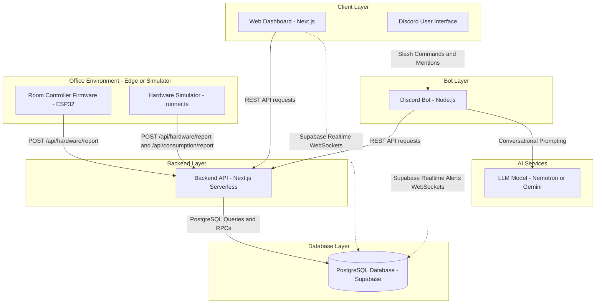
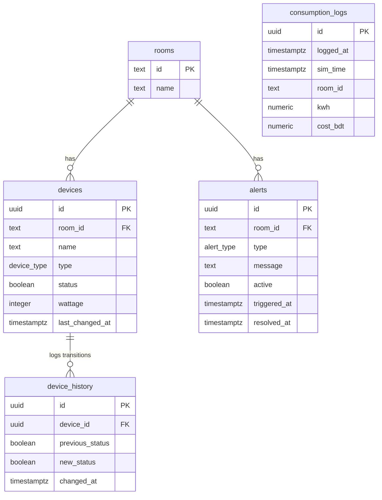
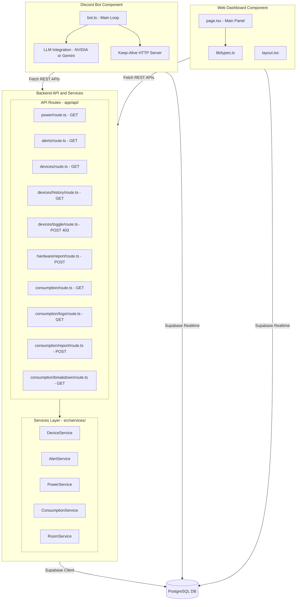
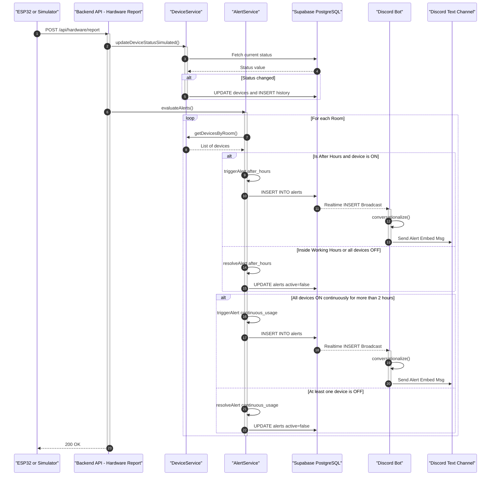
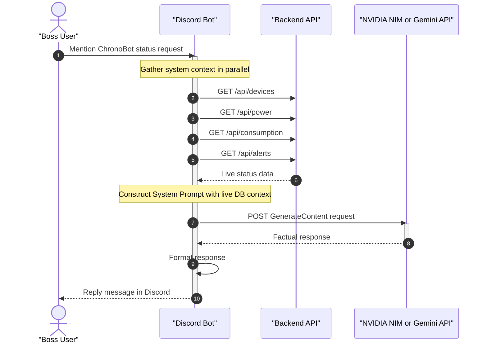

# Chrono Office: Electricity & Device Monitor

Chrono Office is an integrated, real-time IoT monitoring and control system designed to track electrical devices (lights and fans) and electricity consumption across three office rooms (Drawing Room, Work Room 1, and Work Room 2). 

It features:
* **Interactive Web Dashboard**: A real-time Next.js frontend showing active office loads, yesterday's comparison metrics, room controls, and a visual office floor plan.
* **Discord Bot**: Provides a conversational interface to check room status, device power consumption, and recent logs, with proactive warnings when anomalies are detected.
* **Intelligent LLM Chat**: Integration with NVIDIA NIM (Nemotron-3 Super 120B) or Google Gemini API to query live office statuses conversationally.
* **Hardware Simulation Layer**: A hyper-realistic simulator replicating Dhaka office working hours, Brownian voltage walk, staggering, power flicker, and simulated employee interactions.
* **Physical Hardware Blueprint**: Complete circuit schematic design using an ESP32 microcontroller, opto-isolated relay channels, ACS712 current sensors, and AC 220V mains wiring.

---

## 🔗 Live Project Links

* **Backend API Hosting**: [https://project-iut-alert-backend.vercel.app/](https://project-iut-alert-backend.vercel.app/)
* **Web Dashboard**: [https://chrono-office-two.vercel.app/](https://chrono-office-two.vercel.app/)
* **Discord Bot Invite**: [Add Bot to Guild](https://discord.com/oauth2/authorize?client_id=1522877796555292682)
* **Tinkercad Hardware Schematic**: [Tinkercad Interactive Circuit](https://www.tinkercad.com/things/d9lKPrRibuv/editel?sharecode=0FRpBOQlyc4BkpXgR8tdaHEMMs3Qnq1KcieN3BWWfIk)

---

## 🚀 System Architecture

Chrono Office integrates **4 distinct architectural patterns** across its hardware and software layers:
1. **Client-Server Architecture**: Web dashboard clients and Discord bot processes consume stateless API requests from the Next.js serverless backend.
2. **Realtime Event-Driven / Pub-Sub**: Supabase Realtime pushes database modifications (device states, new alerts) instantly via WebSockets to listening clients.
3. **Layered (3-Tier) Software Architecture**: Code structure is divided into a presentation layer (API routes), domain services layer, and data persistence layer (PostgreSQL).
4. **IoT Edge-Cloud Architecture**: Physical room nodes (ESP32 controllers) represent the Edge, managing relays locally and reporting state telemetry to the cloud backend.

---

### 1. Architecture Type 1: High-Level System & Deployment Architecture

This diagram describes the physical and hosted nodes of the system and how they exchange information.



---

### 2. Architecture Type 2: Database & Data Schema Architecture

The database runs on Supabase (PostgreSQL). Below is the database schema, including indexes, constraints, and relationships.



> [!NOTE]
> Database performance is enhanced with several indices:
> * `idx_devices_room` on `devices(room_id)`
> * `idx_history_device_time` on `device_history(device_id, changed_at DESC)`
> * `idx_alerts_active` on `alerts(active)`
> * `idx_alerts_active_room_type` unique index on `alerts(room_id, type) WHERE active = true` (guarantees a room has at most one active alert of a given type).

---

### 3. Architecture Type 3: Low-Level Software Architecture

This section details the internal code layer structure of the Backend API, Web Dashboard, and Discord Bot, followed by sequence flows of their interactions.

#### A. Software Component Layering (UML Component Diagram)



#### B. Device Status Update & Alert Logic Sequence Flow



#### C. Discord Bot Mention & Conversational LLM Chat Flow



---

### 4. Architecture Type 4: Hardware Electrical & Wiring Architecture

A central room controller coordinates power switching and current logging.

* **Schematic Link**: [Tinkercad Circuits Visual Blueprint](https://www.tinkercad.com/things/d9lKPrRibuv/editel?sharecode=0FRpBOQlyc4BkpXgR8tdaHEMMs3Qnq1KcieN3BWWfIk)

#### A. Hardware Connection Layout (UML Block Diagram)

```mermaid
flowchart TD
    subgraph ESP32_Node ["ESP32 Microcontroller"]
        Pin_VIN["VIN - 5V DC Input"]
        Pin_GND["GND - Common Ground"]
        Pin_G12["GPIO 12 - Out: Fan 1"]
        Pin_G13["GPIO 13 - Out: Fan 2"]
        Pin_G14["GPIO 14 - Out: Light 1"]
        Pin_G15["GPIO 15 - Out: Light 2"]
        Pin_G16["GPIO 16 - Out: Light 3"]
        Pin_G34["GPIO 34 - ADC Input: Current"]
    end

    subgraph Relays ["5-Channel Relay Module"]
        R_VCC["VCC"]
        R_GND["GND"]
        R_IN1["IN 1"]
        R_IN2["IN 2"]
        R_IN3["IN 3"]
        R_IN4["IN 4"]
        R_IN5["IN 5"]
        R_COM["COM - Common AC Live input"]
        R_NO1["Normally Open 1"]
        R_NO2["Normally Open 2"]
        R_NO3["Normally Open 3"]
        R_NO4["Normally Open 4"]
        R_NO5["Normally Open 5"]
    end

    subgraph Sensor ["ACS712 Current Sensor"]
        S_VCC["VCC"]
        S_GND["GND"]
        S_OUT["OUT - Analog Output"]
        IP_Plus["IP+ terminal"]
        IP_Minus["IP- terminal"]
    end

    subgraph Div ["Voltage Divider - ADC Protection"]
        R1["Resistor 10 kOhm"]
        R2["Resistor 20 kOhm"]
        Junc["Junction Point - 2/3 Scale"]
    end

    subgraph AC_Loads ["220V AC Devices"]
        Dev_Fan1["Fan 1"]
        Dev_Fan2["Fan 2"]
        Dev_Light1["Light 1"]
        Dev_Light2["Light 2"]
        Dev_Light3["Light 3"]
    end

    subgraph AC_Mains ["220V AC Mains"]
        AC_Live["AC Live Line"]
        AC_Neut["AC Neutral Line"]
    end

    %% Low Voltage DC Connections
    Pin_VIN --> R_VCC & S_VCC
    Pin_GND --> R_GND & S_GND & R2
    Pin_G12 --> R_IN1
    Pin_G13 --> R_IN2
    Pin_G14 --> R_IN3
    Pin_G15 --> R_IN4
    Pin_G16 --> R_IN5

    %% Voltage Divider Connections
    S_OUT --> R1
    R1 --> Junc
    R2 --> Junc
    Junc --> Pin_G34

    %% High Voltage AC Connections
    AC_Live --> IP_Plus
    IP_Minus --> R_COM
    R_NO1 --> Dev_Fan1
    R_NO2 --> Dev_Fan2
    R_NO3 --> Dev_Light1
    R_NO4 --> Dev_Light2
    R_NO5 --> Dev_Light3

    Dev_Fan1 & Dev_Fan2 & Dev_Light1 & Dev_Light2 & Dev_Light3 --> AC_Neut
```



### 2. Electrical Wiring & Circuit Configuration

#### Low-Voltage DC Control System
1. **Power Supply**: Connect the ESP32 **VIN** pin to a regulated **5V DC** source. The `VCC` input pins of both the **5-Channel Relay Module** and the **ACS712 Current Sensor** must connect to this 5V line.
2. **Common Ground**: Connect the ESP32 **GND** pin to the `GND` pins of the Relay Module and the ACS712 sensor.
3. **Relay Control**: Connect GPIOs **12, 13, 14, 15, and 16** on the ESP32 to Relay inputs **IN 1, IN 2, IN 3, IN 4, and IN 5** respectively. (Relays switch on an Active-Low signal).
4. **Current Sensor Scaling (ADC Protection)**:
   * The ACS712 outputs a voltage ranging from `0` to `5V` (centered at `2.5V` for `0` Amps AC current).
   * Since the ESP32's ADC inputs are limited to `3.3V`, a voltage divider is required.
   * Place a **10 kΩ resistor** between ACS712 `OUT` and a junction point.
   * Place a **20 kΩ resistor** between that junction point and `GND`.
   * Connect the junction point directly to **GPIO 34** (ADC1 Channel 6). This scales the analog voltage by $2/3$, ensuring a `5V` peak output is read as a safe `3.33V` value.

#### High-Voltage AC Power System (220V AC Mains)
1. **Live Line Current Path**: Connect the high-voltage **AC Live line** to the `IP+` screw terminal of the ACS712 Current Sensor.
2. **Common Bus Feed**: Connect the sensor's `IP-` output terminal to the **Common (COM)** terminals of all 5 relays in parallel.
3. **Load Terminals**: Connect the **Normally Open (NO)** terminal of:
   * Relay 1 to the Live wire of **Fan 1**
   * Relay 2 to the Live wire of **Fan 2**
   * Relay 3 to the Live wire of **Light 1**
   * Relay 4 to the Live wire of **Light 2**
   * Relay 5 to the Live wire of **Light 3**
4. **Neutral Return Line**: Connect the Neutral wires of all 5 devices back to the main **AC Neutral Line** to close the high-voltage circuit.

---

### 3. Scaling Options (Multi-Room Architecture)

#### Option A: Distributed Architecture (Recommended)
Each room has an independent **ESP32 controller**, a **5-channel relay**, and a **current sensor**. The nodes coordinate over Wi-Fi, reporting to the Supabase database.
* **Pros**: Isolates electrical faults locally; limits high-voltage wiring length through walls.
* **Cons**: Requires 3 microcontrollers.

#### Option B: Centralized Node Architecture (Single ESP32)
A single central ESP32 controls all 15 devices across the office by utilizing separate GPIO channels and ADC pins.

| Room | Component | Type | ESP32 GPIO Pin |
| :--- | :--- | :--- | :--- |
| **Drawing Room** | Fan 1 / Fan 2 / Light 1 / Light 2 / Light 3 | Outputs | **GPIO 12, 13, 14, 15, 16** |
| | Current Sensor | Analog input | **GPIO 34** (ADC1) |
| **Work Room 1** | Fan 1 / Fan 2 / Light 1 / Light 2 / Light 3 | Outputs | **GPIO 17, 18, 19, 21, 22** |
| | Current Sensor | Analog input | **GPIO 35** (ADC1) |
| **Work Room 2** | Fan 1 / Fan 2 / Light 1 / Light 2 / Light 3 | Outputs | **GPIO 23, 25, 26, 27, 32** |
| | Current Sensor | Analog input | **GPIO 36** (ADC1) |

---

## 📡 API Endpoint Reference

All endpoints are hosted on Next.js Serverless and reside under the root backend domain: `https://project-iut-alert-backend.vercel.app/`

### 1. `GET /api/devices`
Returns the status, details, and timestamps of all 15 office devices.
* **Response `200 OK`**:
  ```json
  [
    {
      "id": "d1000000-0000-0000-0000-000000000001",
      "room_id": "drawing-room",
      "name": "Fan 1",
      "type": "fan",
      "status": false,
      "wattage": 60,
      "last_changed_at": "2026-07-04T10:15:00.000Z"
    }
  ]
  ```

### 2. `POST /api/devices/toggle`
Endpoint for manual device control.
* **Note**: Manual control is disabled during simulation.
* **Response `403 Forbidden`**:
  ```json
  { "error": "Manual device control is disabled in this simulation" }
  ```

### 3. `GET /api/devices/history`
Returns a chronological log of the last 50 device state transition events (ON/OFF toggles).
* **Response `200 OK`**:
  ```json
  [
    {
      "id": "h1234567-89ab-cdef-0123-456789abcdef",
      "device_id": "d1000000-0000-0000-0000-000000000001",
      "previous_status": false,
      "new_status": true,
      "changed_at": "2026-07-04T11:12:00.000Z",
      "devices": {
        "name": "Fan 1",
        "type": "fan",
        "room_id": "drawing-room"
      }
    }
  ]
  ```

### 4. `GET /api/power`
Provides real-time voltage and total power load drawing across the entire office.
* **Response `200 OK`**:
  ```json
  {
    "currentPower": 195,
    "voltage": 220.3,
    "simulatedTime": "2026-07-04T11:15:00.000Z",
    "roomBreakdown": {
      "drawing-room": 0,
      "work-room-1": 60,
      "work-room-2": 135
    }
  }
  ```

### 5. `GET /api/consumption`
Returns the aggregated energy consumption metrics and estimated cost for today.
* **Response `200 OK`**:
  ```json
  {
    "dailyKWh": 2.4512,
    "totalKWh": 2.4512,
    "totalCostBDT": 31.89,
    "simulatedTime": "2026-07-04T11:15:00.000Z",
    "rooms": [
      {
        "roomId": "drawing-room",
        "roomName": "Drawing Room",
        "kwh": 0.451,
        "costBDT": 5.87,
        "devices": []
      }
    ]
  }
  ```

### 6. `POST /api/consumption/report`
Saves hourly consumption records pushed by the simulator node.
* **Request Body**:
  ```json
  {
    "logs": [
      {
        "room_id": "drawing-room",
        "sim_time": "2026-07-04T11:00:00.000Z",
        "kwh": 0.0025,
        "cost_bdt": 0.03
      }
    ]
  }
  ```
* **Response `200 OK`**:
  ```json
  { "success": true }
  ```

### 7. `GET /api/consumption/logs`
Returns the recent 50 hourly consumption records logged to the database.
* **Response `200 OK`**:
  ```json
  [
    {
      "id": "c1000000-0000-0000-0000-000000000001",
      "logged_at": "2026-07-04T11:00:05.000Z",
      "sim_time": "2026-07-04T11:00:00.000Z",
      "room_id": "drawing-room",
      "kwh": 0.0025,
      "cost_bdt": 0.03
    }
  ]
  ```

### 8. `GET /api/consumption/breakdown`
Returns a granular breakdown of energy usage (kWh) and cost (BDT) for today, broken down per room and per device.
* **Response `200 OK`**:
  ```json
  {
    "simulatedTime": "2026-07-04T11:15:00.000Z",
    "totalKWh": 2.4512,
    "totalCostBDT": 31.89,
    "rooms": [
      {
        "roomId": "drawing-room",
        "roomName": "Drawing Room",
        "kwh": 0.451,
        "costBDT": 5.87,
        "devices": [
          {
            "id": "d1000000-0000-0000-0000-000000000001",
            "name": "Fan 1",
            "type": "fan",
            "status": false,
            "kwh": 0.15,
            "costBDT": 1.95
          }
        ]
      }
    ]
  }
  ```

### 9. `GET /api/alerts`
Returns all active office alerts.
* **Response `200 OK`**:
  ```json
  [
    {
      "id": "a1000000-0000-0000-0000-000000000001",
      "room_id": "work-room-2",
      "type": "after_hours",
      "message": "Work Room 2 has 2 active devices running after office hours.",
      "active": true,
      "triggered_at": "2026-07-04T11:00:00.000Z",
      "resolved_at": null
    }
  ]
  ```

### 10. `POST /api/hardware/report`
Collects status updates from room nodes, applies simulated transitions, and runs the alert assessment loop.
* **Request Body**:
  ```json
  {
    "roomId": "drawing-room",
    "devices": [
      { "id": "d1000000-0000-0000-0000-000000000001", "status": true }
    ],
    "simulatedTime": "2026-07-04T11:15:00.000Z"
  }
  ```
* **Response `200 OK`**:
  ```json
  { "success": true }
  ```

---

## 🤖 Discord Bot Features & Commands

The Discord bot acts as a smart companion, listening to active alert states and offering conversational support.

### 1. Alert Notifications
The bot connects to Supabase Realtime alerts. When a new alert record with `active: true` is inserted:
1. The bot captures the event.
2. It reformats the notification through the `conversationalize` helper.
3. It posts the message to the configured `#alerts` channel.

### 2. Conversational LLM Chat (Direct Mentions)
When the bot is mentioned (e.g. `@ChronoBot Are the lights off?`):
* It executes parallel API fetches to gather all live device statuses, active alerts, total power load, voltage, and today's energy usage.
* It injects this live data into a specialized System Prompt containing facts about the office environment (rooms, working hours, employee directory).
* It prompts NVIDIA NIM (model: `nvidia/nemotron-3-super-120b-a12b`) or fallback Google Gemini (`gemini-2.5-flash`) to generate a direct response.
* **Conversational Policy**: The AI is strictly guided to answer in 1-3 sentences or clean bullet points using only the provided facts, avoiding speculation about employee actions (e.g., it will not say "perhaps they popped out").

### 3. Command Console
You can query status using manual prefix commands:

* `!help`: Displays a list of all commands.
* `!status`: Summarizes active devices in each room.
* `!room <name>`: Displays detailed status, current power, energy used, and costs for a given room.
* `!usage`: Shows total office wattage draw, daily consumption in kWh, costs, and a room breakdown.
* `!alerts`: Lists any active alerts.
* `!logs`: Shows the last 5 device toggles from history.
* `!records`: Lists the last 5 hourly consumption logs.

---

## 🏃 Running the Project Locally

To run the full stack locally, clone the repository and configure the environments.

### 1. Database Setup
Create a PostgreSQL database on Supabase:
1. Open the **SQL Editor** on your Supabase dashboard.
2. Run `backend/supabase/schema.sql` to initialize tables, indexes, and RPC functions.
3. Run `backend/supabase/seed.sql` to populate rooms and devices.
4. Run `backend/src/db/migrations/004_create_consumption_logs.sql` to initialize the hourly consumption logging table.

### 2. Environment Setup
Create `.env.local` files inside the respective project folders.

#### Backend Env (`backend/.env.local`):
```env
NEXT_PUBLIC_SUPABASE_URL=https://your-supabase-id.supabase.co
NEXT_PUBLIC_SUPABASE_ANON_KEY=your-anon-key
SUPABASE_SERVICE_ROLE_KEY=your-service-role-key
DISCORD_TOKEN=your-discord-bot-token
DISCORD_CHANNEL_ID=your-discord-alerts-channel-id
NVIDIA_NIM_API_KEY=your-optional-nvidia-nim-key
```

#### Web Dashboard Env (`web-dashboard/.env.local`):
```env
NEXT_PUBLIC_SUPABASE_URL=https://your-supabase-id.supabase.co
NEXT_PUBLIC_SUPABASE_ANON_KEY=your-anon-key
NEXT_PUBLIC_BACKEND_API_URL=http://localhost:3000
```

#### Discord Bot Env (`discord-bot/.env`):
```env
DISCORD_TOKEN=your-discord-bot-token
DISCORD_CHANNEL_ID=your-discord-alerts-channel-id
NEXT_PUBLIC_SUPABASE_URL=https://your-supabase-id.supabase.co
SUPABASE_SERVICE_ROLE_KEY=your-service-role-key
BACKEND_API_URL=http://localhost:3000
GEMINI_API_KEY=your-optional-gemini-key
NVIDIA_NIM_API_KEY=your-optional-nvidia-nim-key
```

### 3. Run Components
In separate terminal instances:

* **Start Backend API**:
  ```bash
  cd backend
  npm install
  npm run dev
  ```
  *Hosted locally at `http://localhost:3000`*

* **Start Hardware Simulator**:
  ```bash
  cd backend
  npm run simulator
  ```

* **Start Web Dashboard**:
  ```bash
  cd web-dashboard
  npm install
  npm run dev
  ```
  *Hosted locally at `http://localhost:3001`*

* **Start Discord Bot**:
  ```bash
  cd discord-bot
  npm install
  npm run dev
  ```
